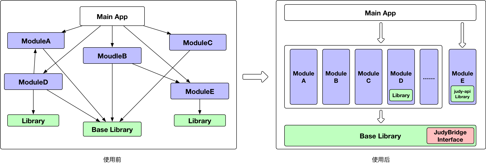

# JudyBridge

## 项目介绍

Android 一个轻量、自由、低学习成本的模块化库。该项目根据各业务模块自定义的服务类自动生成中间层接口，使各个业务模块之间解耦。

轻量：judy-api与judy-plugin源码总共10+个类，代码量也较少，对原理的掌握也很容易。

自由：该库只做中间层生成与具体实现调用，其余异步控制等都自行控制。

低学习成本：开发者只需关注服务类的实现，整个调用过程与平时开发相同，无需学习。


## 使用说明

[](./material/app-release.apk)   [](https://opensource.org/licenses/mit-license.php)


1、在根目录build.gradle构建脚本中添加插件依赖：


```
buildscript {
  repositories {
    jcenter()
   }
   
  dependencies {
  	classpath 'com.zly.judy:judy-plugin:0.3.0'
  }
}
```

2、在基础库模块中buidle.gradle构建脚本中添加依赖：

```
apply plugin: 'judy.bridge'

dependencies {
	api 'com.zly.judy:judy-api:0.3.0'
}
```

###### *PS：只需要在基础库模块中添加即可。*

3、在各业务模块中(AS标准目录结构)创建服务xxx类,在该类上添加@JudyBridge注解，例如：

```
@JudyBridge
public class LoginJudy{

	public boolean isLogin() {……}

	……
}
```

###### *PS：服务类就是供其他业务模块调用的具体实现*

4、在Terminal执行如下命令(生成中间层接口，每次对服务类有任何改动，重新执行命令即可，无需重新build项目)：

```
//mac
./gradlew generatorJudyBridge

//windows
gradlew generatorJudyBridge
```

###### *PS：也可以在AndroidStudio 右侧边栏gradle(Gradle projects) ---> [:基础库名称] ---> Tasks ---> judy ---> 双击generatorJudyBridge*


5、调用：

```
Judy.getBridge(LoginJudyBridge.class).isLogin();
```

###### *PS：详细使用请参考示例demo。*

###### *PS:clone项目后同步Gradle异常解决方法。 [传送门](./material/md/其它问题.md)*

## judy.bridge插件配置属性说明

在配置apply plugin: 'judy.bridge'构建脚本中添加如下配置：

```
//参考ConfigExtension
judyConfig {
    parseFileSuffix "Judy"//模块文件的后缀名规则，用于遍历文件时判断并快速过滤不需要解析文件，可以提升构建速度
    proxyFileSuffix "Bridge"//生成中间层接口文件的后缀名,默认值："Bridge"，生成后的中间层接口文件名为："XXXBridge.java"
    logDebug true//是否输出debug日志信息，默认：false,不输出
}
```

### 属性说明
属性名|说明|默认值
-----|---|----
parseFileSuffix|模块文件的后缀名规则，用于遍历文件时判断并快速过滤不需要解析文件，可以提升构建速度|null
proxyFileSuffix|生成中间层接口文件的后缀名,生成后的中间层接口文件名为："XXXBridge"|Bridge
logDebug|是否输出debug日志信息|false

###### *PS：属性配置参数均为可选，根据需求自行选择。*

## 混淆
开启混淆配置后，所有服务类需要实现KeepSource接口，并在proguard-rules.pro中添加如下配置。

```
# JudyBridge 混淆配置
-keep class com.zly.judy.api.** {*;}
-keep public class * extends com.zly.judy.api.KeepSource {*;}
-keep public class * implements com.zly.judy.api.KeepSource {*;}
```

## 原理

模块化开发通常情况都会有一个基础库，各业务模块都会依赖基础库。正是利用这种特性，通过自定义 Gradle Plugin 实现apt功能，生成各业务模块服务的中间层接口至基础库下（ 路径：build/generated/source/judyBridge/ ），
业务模块通过动态代理、反射调用对应的具体实现，达到跨模块通信的功能。原理和实现代码都非常简单，源码加上注解也只有10+个类，学习相对简单。


自定义Gradle Plugin apt功能简述：
1. 对根路径下的所有模块源码目录（ AndroidStudio 标准目录结构的src下 ）进行递归遍历 java 源文件。
2. 解析该类是否包含指定注解,如果包含则解析并在指定路径下（ 基础库路径：build/generated/source/judyBridge/ ）生成中间层接口源文件，否则跳过该文件。


### 依赖关系


### 相关目录结构说明

```
app				//主项目(壳工程)
BaseLib				//基础库
module				//各业务模块目录
  --- MoudleA			//A业务模块
  --- ModuleB		    	//B业务模块
  --- ModuleC		    	//C业务模块
  --- ModuleLogin		//登录业务模块
judy-api			//依赖库(功能：根据中间层接口执行动态代理、反射调用对应的具体实现)
judy-plugin			//依赖Gralde插件(功能：解析源文件生层中间层)
```

## 其它

[拦截器](./material/md/拦截器.md)

[版本更新](./material/md/版本更新.md)

[其它问题](./material/md/其它问题.md)

## 技术交流

欢迎进群交流心得，加群请说明意图，谢谢。


## License

```
MIT License

Copyright (c) 2018 Zhu LiYa

Permission is hereby granted, free of charge, to any person obtaining a copy
of this software and associated documentation files (the "Software"), to deal
in the Software without restriction, including without limitation the rights
to use, copy, modify, merge, publish, distribute, sublicense, and/or sell
copies of the Software, and to permit persons to whom the Software is
furnished to do so, subject to the following conditions:

The above copyright notice and this permission notice shall be included in all
copies or substantial portions of the Software.

THE SOFTWARE IS PROVIDED "AS IS", WITHOUT WARRANTY OF ANY KIND, EXPRESS OR
IMPLIED, INCLUDING BUT NOT LIMITED TO THE WARRANTIES OF MERCHANTABILITY,
FITNESS FOR A PARTICULAR PURPOSE AND NONINFRINGEMENT. IN NO EVENT SHALL THE
AUTHORS OR COPYRIGHT HOLDERS BE LIABLE FOR ANY CLAIM, DAMAGES OR OTHER
LIABILITY, WHETHER IN AN ACTION OF CONTRACT, TORT OR OTHERWISE, ARISING FROM,
OUT OF OR IN CONNECTION WITH THE SOFTWARE OR THE USE OR OTHER DEALINGS IN THE
SOFTWARE.
```
