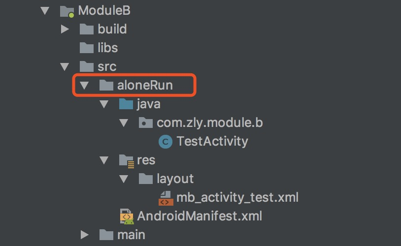
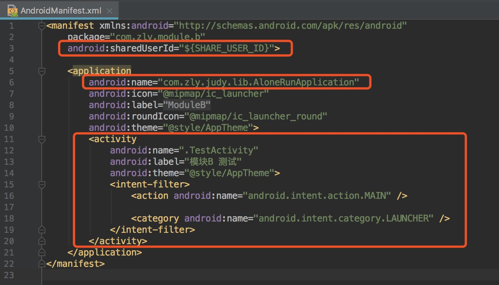
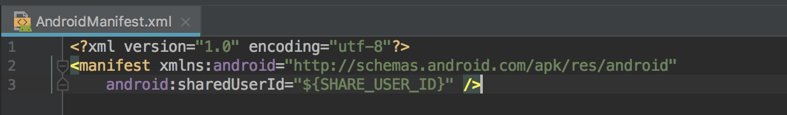

# 业务模块独立运行

## 使用说明

1、首先judy-plugin和judy-api依赖请参考README。

2、在需要独立运行的业务模块的gradle配置文件添加如下配置

```
//apply plugin: 'com.android.library'//注释掉原有配置

apply plugin: 'judy.alone.run'//添加配置并放在第一行
```

3、在对应业务模块src目录下添加aloneRun文件夹，并添加如下结构(如图)：



###### *PS：java类与资源文件根据需求自行添加，也可省略。*

4、在对应业务模块aloneRun/AndroidManifest.xml文件中配置shareUserId属性及application的name属性(如图)：



###### *PS：AloneRunApplication类在BaseLib模块src/debug目录中，请自行参考。*

5、在app模块src/debug目录下添加AndroidManifest.xml文件，并添加shareUserId配置(如图)：



###### *PS：为了追求在release打包后无shareUserId痕迹，所以才在debug目录下添加该文件，也可以在main/AndroidManifest.xml文件中添加。*

6、在项目根目录local.properties文件中添加如下配置：

```
#独立运行业务模块配置
SHARE_USER_ID=com.zly.judy.bridge
ModuleB = false
```

配置SHARE\_USER\_ID是为了使宿主与独立业务模块数据共享。

ModuleB=false配置是对应业务模块的运行模式（true：独立运行模式，false：集成模式），根据需求自行添加业务。**注意：Key必须与模块名一致**


7、配置完以上步骤后，可在项目根目录local.properties文件中自行切换对应业务模块模式。开启独立运行模式后，需要执行一次gradle同步才可运行对应模块。关闭独立运行模式无需执行gradle同步。

使用说明步骤写得比较凌乱，还望见谅。

## 叨叨

本库独立运行并不完美，主要是为了解决当项目足够大时集成编译速度太慢的问题，让项目支持单模块测试，不用对整个项目进行编译，当然有官方的Instant Run，第三方有freeline等都能解决编译慢的问题。


